This Note is about Data Structure and its related algorithms in Computer Science !

This Note Also Include Some Advanced Topics in Data Structure and Advanced Data Structure !

Glimpse of the Content : 
- Array
- Linked List
- Tree
- Heap
- Graph
- Hash Table

Referenced Text Book: 

Introduction to Algorithm


# Linked List

Linked List is a Basic Linked Node Structure. With Node Structure linked list can be implemented quite easy.

```c++
template<typename _Tp>
struct node{
	_Tp data;
	node<_Tp> * next;
}
```
this is a single list node structure

## Single linked list

## Double linked list


# Tree
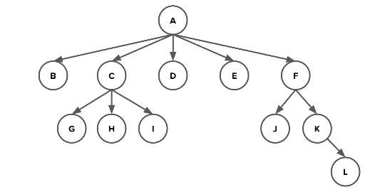
A Tree is either an empty data structure or a single node with zero or more non-empty subtrees.

Some Basic Terminology In Tree : 
- nodes : nodes is the basic part of a tree which normally has its value
- edges : edges are normally the connection between nodes
- root node : only one per tree, usually in the top of the tree
- leaf node : nodes with no children
- depth : the depth of a node is the length of its path to the root
- height : the height of a tree is defined to be the number of levels that a tree has

## Binary Tree

A Binary tree is a tree where every node has either 0,1 or 2 children. No node in a binary tree can have more than 2 children.

```c++
template<typename _Tp>  
struct tree_node{  
    _Tp M_data;  
    tree_node<_Tp>* M_left;  
    tree_node<_Tp>* M_right;  
    explicit tree_node(const _Tp& data) : M_data(data), M_right(nullptr), M_left(nullptr){ };  
};
```
Binary Tree Traverse

First Order:
```c++
template<typename _Tp>  
void first_order_print(tree_node<_Tp>* root){  
    if (root){  
        std::cout << root->M_data << " ";  
        first_order_print(root->M_left);  
        first_order_print(root->M_right);  
    }  
}
```
In Order:
```c++
template<typename _Tp>  
void in_order_print(tree_node<_Tp>* root){  
    if (root){  
        first_order_print(root->M_left);  
        std::cout << root->M_data << " ";  
        first_order_print(root->M_right);  
    }  
}
```
Post Order:
```c++
template<typename _Tp>  
void post_order_print(tree_node<_Tp>* root){  
    if (root){  
        first_order_print(root->M_left);  
        first_order_print(root->M_right);  
        std::cout << root->M_data << " ";  
    }  
}
```

### Binary Search Tree

#### Practice Problem

**_Biggest One_**
Write Two Function, the first one search the biggest element in the binary search tree and the second function search the second biggest element in the binary tree.
```c++
TreeNode* biggestNodeIn(TreeNode* root) {
    if (!root)
        return nullptr;
    if (!root->right)
        return root;
    else
        return biggestNodeIn(root->right);
}

TreeNode* secondBiggestNodeIn(TreeNode* root) {
    if (!root)
        return nullptr;
    else if (!root->right){
        if (root->left)
            return root->left;
        else
            return root;
    }else{
        if (!root->right->right){
            if (root->right->left)
                return root->right->left;
            else
                return root;
        }else
            return secondBiggestNodeIn(root->right);
    }

}
```

**_Tree Height_**

Writing A Function Height that return a tree's height !
> Note a height of a tree is the longest path from its root node to its remotest leaf node

```c++
int height(TreeNode *node) {
    if (!node)
        return 0;

    int left_height = height(node->left);
    int right_height = height(node->right);
    return (left_height > right_height ? left_height : right_height) + 1;
}
```

**_Is Balanced_**
Write a function judge whether a tree is balanced. A tree is balanced if its left and right subtrees are balanced trees whose heights differ by at most 1. The empty tree is defined to be balanced.

```c++
bool isBalanced(TreeNode *node) {
    if (node == nullptr) {
        return true;
    } else if (!isBalanced(node->left) || !isBalanced(node->right)) {
        return false;
    } else {
        int leftHeight = height(node->left); 
        int rightHeight = height(node->right);
        return abs(leftHeight - rightHeight) <= 1;
    }
}
```

**_Validate A Binary Search Tree_**

A Binary Search tree is either an empty tree or  it’s a node `x` whose left subtree is a BST of values smaller than `x` and whose right subtree is a BST of values greater than `x`.

Write a function that judge a binary tree is whether a binary search tree.
```c++
bool isBST_axu(TreeNode * root, TreeNode * lowerBound, TreeNode * upperBound){
    if (!root)
        return true;

    // Check Whether The Value Break The Boundary
    if (lowerBound && root->data <= lowerBound->data)
        return false;
    if (upperBound && root->data >= upperBound->data)
        return false;

    // Update The Boundary Limit For The Left and Right Node
    // One Boundary Limit Update In the both side
    
    // To Visualize this kind of algorithm just draw a diagram
    return isBST_axu(root->left, lowerBound, root) && isBST_axu(root->right, root, upperBound);

}
bool isBST(TreeNode* root) {
    return isBST_axu(root, nullptr, nullptr);
}
```


## Coding Tree

A Coding Tree is used to compress Data and make the data lossless. A Coding tree is valid if all the letters are stored at the leaves, with internal nodes just doing the routing.

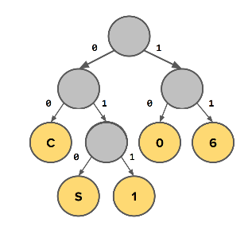

### Huffman Coding Tree

#### Structure
Huffman Coding Tree is an optimal coding tree. And It is also a variable-length Coding Tree.

**_Some Properties_**:
- The shorter paths represent frequently occurring characters that are being encoded with fewer bits. 
- The longer paths are more rare characters that are being encoded with more bits.

Huffman Coding Tree usually use a priority queue to construct the tree node !

**_About The Priority Queue_**:
When we have choices among equally weighted nodes, picking a different pair will result in a different, but still optimal, encoding Tree. 

Similarly, when combining two subtrees, it is equally valid to put one of the trees on the left and the other on the right as it is to reverse them.

Although all such trees are optimal, in order to faithfully restore the original contents, we must be sure to use the exact same tree to decode as was used to encode.


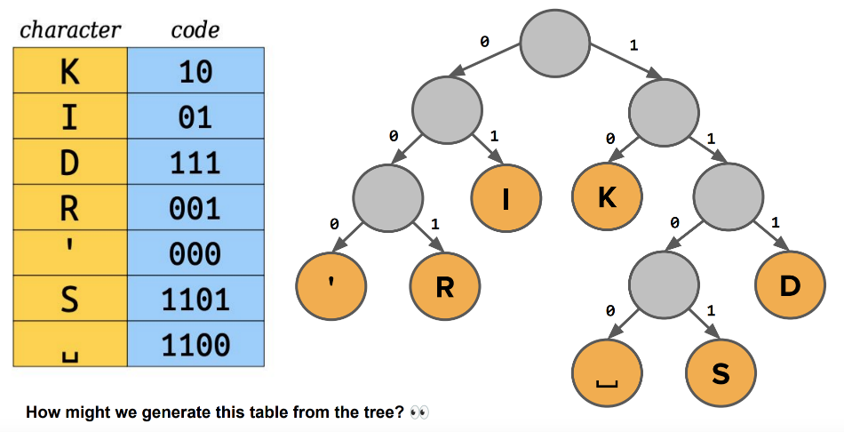

Fixed-Length Coding Tree
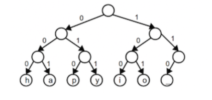
Variable-length Huffman Encoding Tree
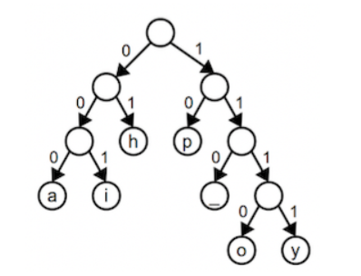

The Compressed File Include Two Parts 
1. Flatten Tree
2. Raw Data
Which means we need also treat the two parts separately !
#### Compress

Compress A File Into Huffman Raw Data need some steps:
1. Build A Unique Huffman Coding Tree
2. Encode Data Using Huffman Coding Tree
3. Build Flatten Tree

And Finally Bundle Them Together !

> These Codes come from Stanford CS 106B Assignment 6 Huffman Coding
```c++
EncodedData compress(string messageText) {
    EncodedData result;
	// Build A Unique Huffman Coding Tree
    EncodingTreeNode* huffmanCodingTree = buildHuffmanTree(messageText);
    // Encode Data Using Huffman Coding Tree
    Queue<Bit> content = encodeText(huffmanCodingTree, messageText);
    result.messageBits = content;
    // Build Flatten Tree
    flattenTree(huffmanCodingTree, result.treeShape, result.treeLeaves);
    deallocateTree(huffmanCodingTree);
    
    return result;
}
```
##### Build Huffman Tree

To build a Huffman tree we need to used a priority queue. Create a leaf node for each character and its weight. Each node is a singleton tree, and a collection of trees is called a _forest_. Merge the forest of trees into one combined tree from the bottom upwards.

1. Find the two trees with the smallest weights in the forest and remove them.
2. Create a new tree with these two trees as its subtrees. This tree's weight is equal to the sum of the weights of its subtrees.
3. Add the new combined tree back into the forest.
4. Repeat steps 1-3 until there is only one tree left in the forest. This is the final encoding tree.

This is a Visualization Diagram For Building Huffman Tree

1. First Create Many Leaf Node of the Huffman Coding Trees
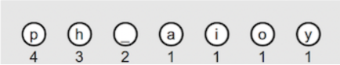
2. Connect the two lowest weight nodes, and make them become a new node which weight is the sum of the two nodes. And add the new node to the priority queue.
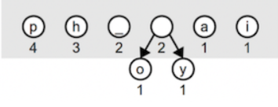
3. Repeat the process of 2.
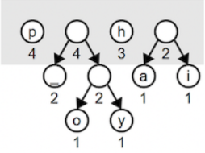
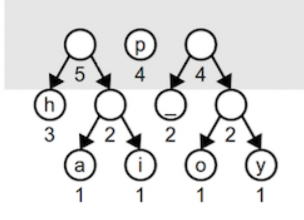
4. When there is only left two nodes merge them into one final tree
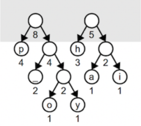
5. dequeue the final tree from the priority queue, this final tree is the Huffman Coding Tree.
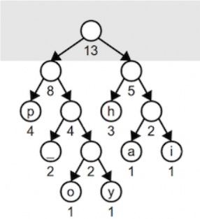

> These Codes come from Stanford CS 106B Assignment 6 Huffman Coding
```c++
struct priority_node{
    priority_node(EncodingTreeNode* _node, unsigned int _prior) : node(_node), prior(_prior) { }
    EncodingTreeNode* node;
    unsigned int prior;
};

EncodingTreeNode* buildHuffmanTree(string text) {
    std::map<char, unsigned int> mapper;
    for (char _char : text)
        mapper[_char]++;
    PriorityQueue<priority_node> PQ_buffer;
    for (const auto &[key, value] : mapper)
        PQ_buffer.enqueue(priority_node(new EncodingTreeNode(key), value), static_cast<double>(value));
    while (PQ_buffer.size() > 1) {
        priority_node left = PQ_buffer.dequeue();
        priority_node right = PQ_buffer.dequeue();
        priority_node new_node = priority_node(new EncodingTreeNode(left.node, right.node), left.prior + right.prior);
        PQ_buffer.enqueue(new_node, static_cast<double>(new_node.prior));
    }
    return PQ_buffer.dequeue().node;
}
```

##### Encode The Data

To Encode The Data we need to first traverse the whole tree and build a mapper, map from the character and their encoded coding. For Example `A = 011`. To achieve this we can use `std::map`.

After map character and encoded coding we can repeated encode the file through access the mapper.

> These Codes come from Stanford CS 106B Assignment 6 Huffman Coding
```c++
void traverse_leaf(std::map<char, std::vector<Bit>>& buffer, EncodingTreeNode* tree, std::vector<Bit>& coding){
    if (tree->isLeaf()){
        buffer.insert({tree->getChar(), coding});
        return;
    }
    coding.push_back(0);
    traverse_leaf(buffer, tree->zero, coding);
    coding.pop_back();

    coding.push_back(1);
    traverse_leaf(buffer, tree->one, coding);
    coding.pop_back();
}

Queue<Bit> encodeText(EncodingTreeNode* tree, string text) {
    std::map<char, std::vector<Bit>> buffer;
    std::vector<Bit> coding;
    Queue<Bit> result;
    traverse_leaf(buffer, tree, coding);

    for (char _char : text){
        for (auto& bit : buffer[_char])
            result.enqueue(bit);
    }

    return result;
}
```

##### Flatten Tree

We also need to embed the flatten the Huffman Coding Tree in the raw file so that the receiver can use the same tree to decode the file.

We can accomplish this through build a meta-data: 
- the single bit 0/1 represent the tree shape (0 represent leaf-node, 1 represent non-leaf node)
- the character sequence which represents the leaf-node data

the first one we can use **_pre-order_** and the second one we can use **_post-order_**

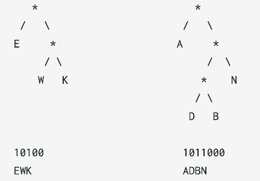

> These Codes come from Stanford CS 106B Assignment 6 Huffman Coding
```c++
void flattenTree(EncodingTreeNode* tree, Queue<Bit>& treeShape, Queue<char>& treeLeaves) {
    if (tree->isLeaf()){
        treeShape.enqueue(0);
        treeLeaves.enqueue(tree->getChar());
        return;
    }
    treeShape.enqueue(1);
    flattenTree(tree->zero, treeShape, treeLeaves);
    flattenTree(tree->one, treeShape, treeLeaves);
}
```

#### Decompress

Decompress is a similar process with Compress. But simpler.
1. Get Huffman Coding Tree through Flatten Huffman Tree
2. Decode the File using Huffman Tree

Compound the two steps we are done !

> These Codes come from Stanford CS 106B Assignment 6 Huffman Coding
```c++
string decompress(EncodedData& data) {
	// Get Huffman Coding Tree through Flatten Huffman Tree
    EncodingTreeNode * HuffmanTree = unflattenTree(data.treeShape, data.treeLeaves);
    // Decode the File using Huffman Tree
    auto result = decodeText(HuffmanTree, data.messageBits);
    deallocateTree(HuffmanTree);
    return result;
}
```
##### Unflatten Tree

We need firstly need to unflatten the Huffman tree in the meta-data. We need construct the Huffman Tree Using Flatten Huffman tree.

Through traverse the whole Tree, we need construct the Huffman tree from root node and go deep one node. If a node is a leaf-node we construct directly else we construct its subtree recursively.

> These Codes come from Stanford CS 106B Assignment 6 Huffman Coding
```c++
EncodingTreeNode* unflattenTree(Queue<Bit>& treeShape, Queue<char>& treeLeaves) {
    EncodingTreeNode* root = nullptr;
    Bit single_bit = treeShape.dequeue();

    if (single_bit == 1)
        root = new EncodingTreeNode(nullptr, nullptr);
    else{
        root = new EncodingTreeNode(treeLeaves.dequeue());
        return root;
    }
    root->zero = unflattenTree(treeShape, treeLeaves);
    root->one = unflattenTree(treeShape, treeLeaves);
    return root;
}
```

##### Decode The Data

After we get the Huffman Tree, we can now decode the meta-data using it. We control whether access the left-child node or the right-child node through judge the single bit, if it is 0 we go left else we go right and if it is a leaf node we need to add the single character to the result data and reset the current node to the root.

Repeat it until we reach the end of the bit sequence.

> These Codes come from Stanford CS 106B Assignment 6 Huffman Coding
```c++
string decodeText(EncodingTreeNode* tree, Queue<Bit>& messageBits) {
    if (messageBits.isEmpty())
        return {};
    EncodingTreeNode * current_node = tree;
    std::string result_data;
    Bit single_bit;
    while (!messageBits.isEmpty()){
        if (current_node->isLeaf()){
            result_data += current_node->getChar();
            current_node = tree;
            continue;
        }
        single_bit = messageBits.dequeue();
        if (single_bit == 1)
            current_node = current_node->one;
        else
            current_node = current_node->zero;
    }
    if (current_node->isLeaf())
        result_data += current_node->getChar();
    return result_data;
}
```


# Heap
Heap is a special Data Structure. Which Inner Implementation is a binary tree Diagram.
## Mini Heap

Definition : A Min Heap is a binary tree with the following structural and ordering properties.
- It is a complete binary tree : every level fills up from left to right with no gaps before moving on to the next level.
- Ordering Property : Every Node's value (priority) must be less than or equal to the values of any/all of its children

### Operation
Mini Heap Operation Runtime

| Operation       | Best-Case Runtime | Worst-Case Runtime |
| --------------- | ----------------- | ------------------ |
| insertion(push) | $O(1)$            | $O(logn)$          |
| deletion(pop)   | $O(1)$            | $O(logn)$          |
| findMin(peek)   | $O(1)$            | $O(1)$             |

> MiniHeap Only Support deletion of the minimum value in the heap, not of arbitrary values. Same for the find/search/get operation

Insertion Process In MiniHeap
1. Insert at the next open position
2. percolate up
Deletion Process In MiniHeap
1. Preserve the structural property, the last value (bottom-right) moves up to the root position
2. Restore ordering property by percolating down.

### Structure
Mini Heap is representation using an array/vector depends on the situation, so that we can have $O(1)$ time to access elements in the mini heap !

Formula for the structure.
- $leftchild(i)=2i+1$
- $rightchild(i)=2i+2$
- $parent(i)=(i-1)/2$

The `Buffer[0]` is the minimal elements in the heap and the Buffer `[Buffer.size()-1]` is the insertion position of the element.

## Maxi Heap

A MaxiHeap has the same structure property as a miniHeap, but the ordering property is inverted every node's value (priority) must be greater than or equal to the values of any/all of its children.

We can implement this traits using functor in the template parameter.
### Operation
Maxi Heap Operation Runtime

| Operation       | Best-Case Runtime | Worst-Case Runtime |
| --------------- | ----------------- | ------------------ |
| insertion(push) | $O(1)$            | $O(logn)$          |
| deletion(pop)   | $O(1)$            | $O(logn)$          |
| findMin(peek)   | $O(1)$            | $O(1)$             |


> Maxi Heap Only Support deletion of the maximum value in the heap, not of arbitrary values. Same for the find/search/get operation

Insertion Process In MiniHeap
1. Insert at the next open position
2. percolate up
Deletion Process In MaxiHeap
1. Preserve the structural property, the last value (bottom-right) moves up to the root position
2. Restore ordering property by percolating down.
   
### Structure
Maxi Heap is representation using an array/vector depends on the situation, so that we can have $O(1)$ time to access elements in the maxi heap !

Formula for the structure.
- $leftchild(i)=2i+1$
- $rightchild(i)=2i+2$
- $parent(i)=(i-1)/2$

The `Buffer[0]` is the maximum elements in the heap and the Buffer `[Buffer.size()-1]` is the insertion position of the element.


## Application

### Core Function

The Implementation For Core Function Percolate_Down And Percolate_Up
Notice That Percolate Up only need to consider the parent node, but the Percolate Down need more considerations so that it can treat the left child index and right child index properly !

Percolate Down :
```c++
template<typename _RandomAccessIterator, typename _Size, typename _Compare>  
void percolate_down(_RandomAccessIterator __first, _Size __index, _Size __len, _Compare __compare){  
    if (__len < 2)  
        return;  
    const _Size _search_max = (__len - 2) / 2;  
    while (__index <= _search_max){  
        _Size _left_index = __index * 2 + 1;  
        _Size _right_index = __index * 2 + 2;  
        _Size _swap_index;  
        /// Judge Whether the right node exist
        if (_right_index <= __len - 1){  
            if (__compare(__first[__index], __first[_left_index]) &&  
            __compare(__first[__index], __first[_right_index]))  
                return;  
            _swap_index = __compare(__first[_left_index],  
                                    __first[_right_index]) ? _left_index : _right_index;  
        } else{  
        /// Left Node must exist beacuse the boundary restrictions is to ensure that the search span only             ///cover valid range
            if (__compare(__first[__index], __first[_left_index]))  
                return;  
            _swap_index = _left_index;  
        }  
        std::swap(__first[__index], __first[_swap_index]);  
        __index = _swap_index;  
    }  
}
```

Percolate Up : 
```c++
template<typename _RandomAccessIterator, typename _Size, typename _Compare>  
void percolate_up(_RandomAccessIterator __first, _Size __index, _Compare __compare){  
    if (__index == 0)  
        return;  
    /// Just try to find parent node index until meet the boundary condition which index == 0
    for (_Size index_parent;  __index != 0; ){  
        index_parent = (__index - 1) / 2;  
        if (!__compare(__first[__index], __first[index_parent]))  
            break;  
        std::swap(__first[__index], __first[index_parent]);  
        __index = index_parent;  
    }  
}
```

### Heap Sort
Using Heap Data Structure We can implement an efficient Sort Algorithm.

1. Insert n elements into miniHeap - $O(n\ log\ n)$
2. Remove all elements from miniHeap place them in a vector as they come out - $O(n\ log\ n)$

Heap Sort Implementation in C++ Template
```c++
template<typename _RandomIterator>  
void heap_sort(_RandomIterator __first, _RandomIterator __last){  
    typedef typename std::iterator_traits<_RandomIterator>::value_type Value_Type;  
    container::priority_queue<Value_Type, std::less<Value_Type>, std::vector<Value_Type>> __buffer;  
    auto __current = __first;  
    for ( ; __current != __last; ++__current)  
        __buffer.push(*__current);  
    __current = __first;  
    while (!__buffer.empty()){  
        *__current = __buffer.top();  
        __buffer.pop();  
        ++__current;  
    }  
}
```

### Heapify
Heapify is an Algorithm for turning an arbitrary array/complete binary tree into a miniHeap in place (without creating a new array)

Let BRMNLN be the index of the bottom-right most non-leaf node in the complete binary tree represented by the given array call `percolateDown()` starting at index BRMNLN and down through index 0 (the root)

The BRMNLN Index is the last Botton-Right Most Non-Leaf Node In the Complete Binary Tree, And usual write as (length - 2) / 2 .
```c++
for (int i = BRMNLN; i >= 0; i--){
	percolateDown(i);
}
```
This Percolates Larger Values down while squishing smaller elements up in the heap !

Using Percolate_Down and Percolate_Up Function its quite easy to implementation functions such as heap_sort or heapify(In C++ Standard Template Library It is usually called std::make_heap), Just Using the implemented helper functions:
```c++
template<typename _RandomAccessIterator,  typename _Compare>  
void make_heap(_RandomAccessIterator __first ,_RandomAccessIterator __last, _Compare __compare){  
    typedef typename std::iterator_traits<_RandomAccessIterator>::difference_type Diff_Type;  
    Diff_Type  len = std::distance(__first, __last);  
    for (Diff_Type _index = (len - 2) / 2; _index >= 0; --_index){  
        percolate_down(__first, _index, len, __compare);  
    }  
}
```


# Graph


# Hash table

A Normal Hash Table is usually constructed with a _bucket_ and some _slots_, namely an array and some linked lists.

We use a hash function to determine the index of the element in the bucket. And store them in the right place.

The Usually Hash Rules:
	bucket = hash(value) % numBuckets

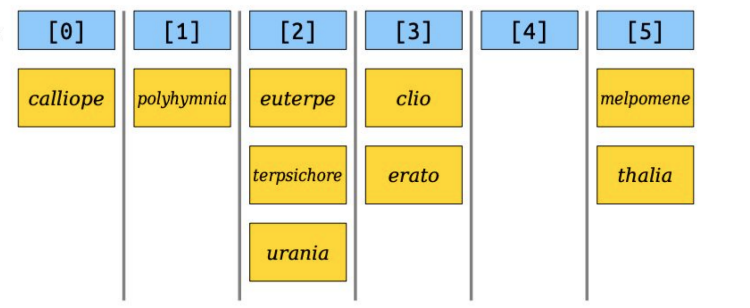

**_Load Factor_**
We call $\alpha = n\  / \ b$ our load factor. which $n$ means the number of elements and $b$ means the number of bucket
- if $\alpha$ gets too big which means the hash table will be too slow.
- if $\alpha$ gets too low, which means the hash table will waste too much space.

Idea: If $\alpha$ gets too big, which means $n$ keep increasing too big. we need to resize our underlying buckets array and rehash the values to new buckets in the larger array. We double our number of buckets when we hit a particular threshold for our load factor. (We’ll use the threshold of $\alpha >= 2$)


> Simple Implementation Of Hash Table:
```c++
template<class _Tp>  
struct _hash_node{  
    _hash_node<_Tp> * _next;  
    _Tp _data;  
    constexpr _hash_node(const _Tp& value, _hash_node<_Tp> * next)  
        noexcept : _data(value), _next(next) { }  
};  
  
template<typename _Tp>  
class hash_table{  
public:  
    hash_table();  
    hash_table(std::initializer_list<_Tp>li);  
    ~hash_table();  
  
    void add(const _Tp& value);  
    void clear();  
    bool contains(const _Tp& value) const;  
    std::size_t size() const;  
    void rehash();  
    size_t capacity()const;  
private:  
    enum {DEFAULT_CAPACITY = 10, EXPAND_SIZE = 2};  
    _hash_node<_Tp> ** _elements;  
    std::size_t _size;  
    std::size_t _capacity;  
    int getIndexOf(const _Tp& value) const;  
};  
  
template<typename _Tp>  
size_t hash_table<_Tp>::capacity() const {  
    return this->_capacity;  
}  
  
template<typename _Tp>  
hash_table<_Tp>::hash_table(std::initializer_list<_Tp> li) : hash_table() {  
    for (auto Iter = li.begin(); Iter != li.end(); ++Iter)  
        this->add(*Iter);  
}  
  
template<typename _Tp>  
bool hash_table<_Tp>::contains(const _Tp &value) const {  
    auto __index_bucket = this->getIndexOf(value);  
    _hash_node<_Tp> * __current = this->_elements[__index_bucket];  
    while (__current){  
        if (__current->_data == value)  
            return true;  
        __current = __current->_next;  
    }  
    return false;  
}  
  
template<typename _Tp>  
std::size_t hash_table<_Tp>::size() const {  
    return this->_size;  
}  
  
template<typename _Tp>  
void hash_table<_Tp>::rehash() {  
    _hash_node<_Tp>** __old_element = this->_elements;  
    auto __old_capacity = this->_capacity;  
    this->_capacity *= EXPAND_SIZE;  
    this->_elements = new _hash_node<_Tp>*[this->_capacity]();  
  
    for (int __index_bucket = 0; __index_bucket != __old_capacity; ++__index_bucket){  
        _hash_node<_Tp>* __current = __old_element[__index_bucket];  
        while (__current){  
            _hash_node<_Tp>* __prev = __current;  
            __current = __current->_next;  
            int __index_element = this->getIndexOf(__prev->_data);  
            __prev->_next = this->_elements[__index_element];  
            this->_elements[__index_element] = __prev;  
        }  
    }  
    delete[] __old_element;  
}  
  
template<typename _Tp>  
int hash_table<_Tp>::getIndexOf(const _Tp &value) const {  
    return std::hash<_Tp>()(value) % this->_capacity;  
}  
  
template<typename _Tp>  
void hash_table<_Tp>::clear() {  
    for (int __index_bucket = 0; __index_bucket != this->_capacity; ++__index_bucket){  
        while (this->_elements[__index_bucket]){  
            _hash_node<_Tp>* __current = this->_elements[__index_bucket];  
            this->_elements[__index_bucket] = this->_elements[__index_bucket]->_next;  
            delete __current;  
        }  
    }  
    this->_size = 0;  
}  
  
template<typename _Tp>  
void hash_table<_Tp>::add(const _Tp &value) {  
    if (!this->contains(value)){  
        this->_elements[this->getIndexOf(value)] =  
                new _hash_node<_Tp>(value, this->_elements[this->getIndexOf(value)]);  
        this->_size++;  
        if (this->_size / this->_capacity >= 2)  
            this->rehash();  
    }  
}  
  
template<typename _Tp>  
hash_table<_Tp>::~hash_table() {  
    this->clear();  
    delete[] this->_elements;  
}  
  
template<typename _Tp>  
hash_table<_Tp>::hash_table() :  
    _capacity(DEFAULT_CAPACITY), _size(0), _elements(new _hash_node<_Tp>*[DEFAULT_CAPACITY]()) { }
```

