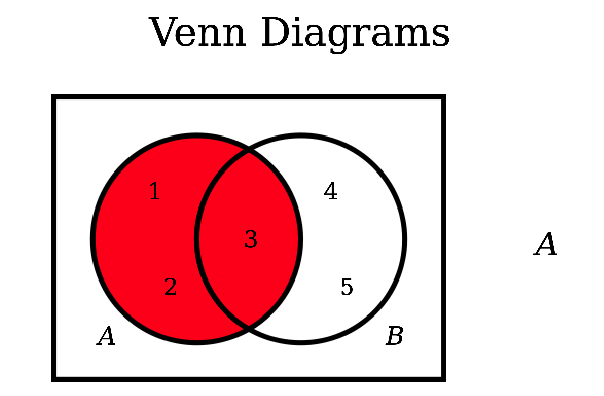
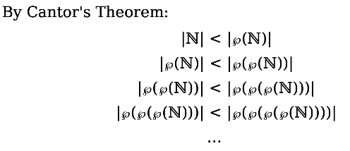
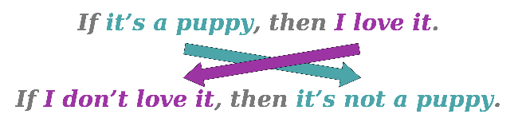

This Note Include A lot useful material and tips in Discrete Mathematics !

# Set Theory

## Concept
A set is an unordered collection of distinct objects, which may be anything, including other sets.

Set Traits:
- Sets can't contain duplicate elements any repeated elements are ignored
- Two Sets are equal when they have same contents regardless their order.

Some Special Set:
- $\mathbb{N}:$ Natural Set $\{0,1,2,3,4,5...\}$
- $\mathbb{Z}:$ Intergal Set $\{...-3,-2,-1,0,1,2,3,...\}$
- $\mathbb{R}:$ Real Number Set $\{e, 3.24342, -137, \pi,4\}$

SubSet
 A set S is called a subset of a set T (denoted S ⊆ T) if all elements of S are also elements of T.
- We say that S ∈ T if, among the elements of T, one of them is exactly the object S. 
- We say that S ⊆ T if S is a set and every element of S is also an element of T. (S has to be a set for the statement S ⊆ T to be true.) 

Empty Set

A Set which doesn't have one element is an empty set, the empty set is a subset of any set S.
Any elements doesn't belong to the empty set.
The Empty Set Write as $\emptyset$ in Set theory !

And This Statement is always true, $S$ is any Set
$$ \emptyset \subseteq S$$

## Set Operation

### Basic Operation

There are some Set Operations. And They all follow some rules !

Given the Venn Diagrams:
$A = \{1,2,3\}$, $B=\{3,4,5\}$

| Operation            | Notation    | Value           |
| -------------------- | ----------- | --------------- |
| Union                | $A\cup B$   | $\{1,2,3,4,5\}$ |
| Intersection         | $A\cap B$   | $\{3\}$         |
| Difference           | $A-B$       | $\{1,2\}$       |
| Symmetric Difference | $A\Delta B$ | $\{1,2,4,5\}$   |

All Sets Operations Table

| Symbol          | Read As              | Meaning                                     |
| --------------- | -------------------- | ------------------------------------------- |
| $x \in S$       | Element of           | S contains x                                |
| $S \subseteq T$ | Subset of            | All the elements in S also in T             |
| $S\cup T$       | Union                | Set containing elements in either S or T    |
| $S\cap T$       | Intersection         | Set containing elements in both S and T     |
| $S - T$         | Difference           | Set containing elements in S, but not in T  |
| $S \Delta T$    | Symmetric Difference | Set containing elements in one but not both |
| $\wp(S)$        | Power Set            | Set of all subsets of S                     |
| $\emptyset$     | Empty Set            | Set with no elements                        |
| \|S\|           | Cardinality          | Number of elements in S                     |

### Power Set

Cardinality

The cardinality of a set is the number of elements it contains. Generally Speaking it is the size of the set. Denoted As $|S|$

> What is the cardinality of $\mathbb{N}$ $(|\mathbb{N}|)$ ?

There are many infinitely many natural numbers, so we need introduce a new term $\aleph_0$.
Let's Define $$|\mathbb{N}| = \aleph_0$$

Power Set

Define the power set of $S$, means the set of all subsets of $S$. We write the power set of S as $\wp(S)$ 
For Example Given The Set $S=\{1,2\}$, the power set of $S$ is 
$$ \wp(S) = \{\{\},\{1\},\{2\},\{1,2\}\}$$
If the cardinality of $S$ is $|S|$, then the cardinality of power set of $S$ will be $2^{|S|}$. So This Statement is also true if the $S$ is finite Set
$$|\wp(S)| = 2^{|S|}$$

Interesting Theorem:

Every Set is strictly smaller that its power set 

> Interesting Rules : Given elements of the set $\wp(\wp(\mathbb{N}))$. These are subsets of the set $\wp(\mathbb{N})$  

# Mathematical Proof

## Statement

Overview :
- Universally-Quantified Statement : User can make any arbitrary choices
- Existentially-Quantified Statement : Only Some Particular choices can be used

### Universally-Quantified Statement

A universally-quantified statement usually in this format !
	For all x, _some-property_ holds for x

Example :

Theorem: For any integers $m$ and $n$, if $m$ and $n$ are odd, then $m + n$ is even. 
Proof: Consider any arbitrary integers $m$ and $n$ where $m$ and $n$ are odd. We need to show that $m + n$ is even. 
Since m is odd, we know that there is an integer k where 
$$ m = 2k + 1. \ (1) $$
Similarly, because n is odd there must be some integer r such that 
$$n = 2r + 1.\ (2) $$
By adding equations (1) and (2) we learn that 
$$ \begin{align} 
m + n &= 2k + 1 + 2r + 1 \\ &= 2k + 2r + 2 \\ &= 2(k + r + 1). \ \ (3)
\end{align}
$$ 
Equation (3) tells us that there is an integer $s$ (namely, $k + r + 1$) such that $m + n = 2s$. Therefore, we see that $m + n$ is even, as required.■

### Existentially-Quantified Statement

An existentially-quantified statement is a statement of the form
	There is some $x$ where _some-property_ holds for x.

Example:

Theorem: For any odd integer $n$, there exist integers $r$ and $s$ where $r^2 - s^2=n$
Proof: Let n be an arbitrary odd integer. We will show that there exist integers $r$ and $s$ where  $r^2 - s^2=n$ 
Since $n$ is odd, we know there is an integer $k$ where $n = 2k + 1$. Now, let $r = k+1$ and $s = k$. Then we see that 
$$
\begin{align}
r ^2 \ – \ s ^2 &= (k+1)^2 –\ k ^2 \\ 
&= k ^2 + 2k + 1 \ – \ k ^2 \\&= 2k + 1 \\&= n.
\end{align}
$$
This means that $r^ 2\ – \ s^ 2 = n$, which is what we needed to show. ■

## Proof 

### Direct Proof

Direction using normal statement to state that the propositional logical is true. A Direct Proof usually using an implication to confirm this statement.
An implication is a statement of the form :
	If P is true, then Q is true.
In mathematics, implication is directional.

Direct Proof always keep with the formal propositional logic and sometimes has a statement.
### Indirect Proof

#### Negation

The Negation of a Propositional Logical Statement is either true or false.
- The Negation of a Universal Statement is the Existential Statement
- The Negation of a Existential Statement is the Universal Statement

> Two Important Note : 
> The Negation of an implication is not an implication .
> The Negation of an statement is still an statement

#### Contradiction
Key Idea: Prove a statement P is true by showing that it isn’t false.

First, assume that P is false. The goal is to show that this assumption is silly. Next, show this leads to an impossible result. Finally, conclude that since P can’t be false, we know that P must be true.

#### Contrapositive
The Contrapositive of the implication is the implication.

For Example. :
	If $P$ is true, then $Q$ is true
Contrapositive Proof 
	If $Q$ is false, then $P$ is false

It will swap the position of the two statements which means swap the _antecedent_ and _consequent_.

The contrapositive of an implication means exactly the same thing as the implication itself