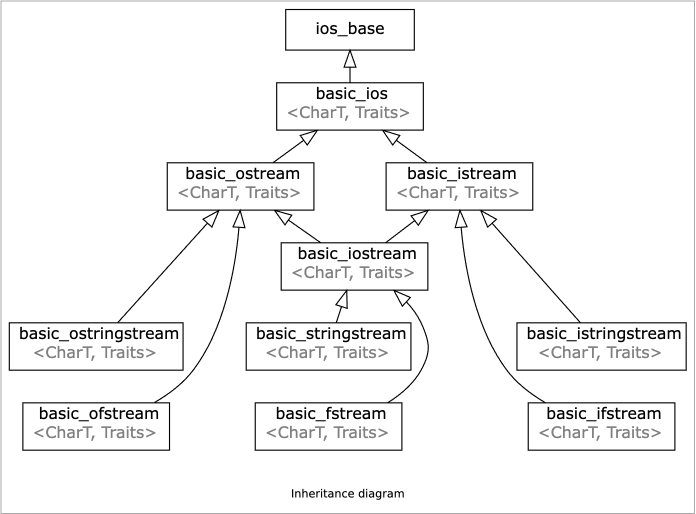
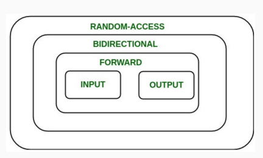

This Note Mainly List Some Class or template Class In C++ and Some Utilities Functions In C++ ! Later In this Note it also display how to implement a C++ Standard template Library !

Overview of the Content !

- String Library
- IO Library
- Container Library
- Utility Library
- Iterator Library


# String Library

In C++ String Library Mainly include std::basic_string and some other forms of String Operation. The Library is implemented using Template and Class !

## basic_string

The class template _basic_string_ stores and manipulates sequences of character-like objects.
### basic_string Data Type


### basic_string member function

Overview of the basic_string member function

> All of these functions are member function, these notes is condensed and ignored the template and specialization traits !

| Member Function             | Descriptions                                                                                                                  |
| --------------------------- | ----------------------------------------------------------------------------------------------------------------------------- |
| append(str)                 | add text to the end of a string                                                                                               |
| compare(str)                | return -1, 0, or 1 depending on relative ordering                                                                             |
| erase(index,length)         | delete text from a string starting at given index                                                                             |
| find(str)  <br>rfind(str)   | return first or last index where the start of str appears in this string (returns _string::npos_ if not found)                |
| insert(index, str)          | add text into string at a given index                                                                                         |
| length()                    | return number of characters in the string                                                                                     |
| replace(index,len,str)      | replace len chars at given index with new text                                                                                |
| substr(start, length)  <br> | return a new string with the next length chars beginning at start (inclusive); if length is omitted, grabs till end of string |
| size()                      | return number of characters in the string                                                                                     |

### basic_string Non-member function

Overview of the content :
- [get_line](#get_line)

#### get_line
```c++
istream& getline(istream& is, string& str, char delim);
```

Description:
	_get_line()_ reads an input stream from _is_ up until the delim char and stores it in the buffer _str_, the _delim_ char is by default `\n` , and _get_line()_  function will consumes the delim character !

Argument:
- is : read from which stream
- str : destination buffer store the result
- delim: read process will be stopped when it read delim

return:
	return input stream

# IO Library

IO Library In C++ is divided into three different parts:
- Stream Based IO
- Print Based IO
- C-Style Based IO

The Most Important one is Stream Based IO Library

> the Print Based IO Start at ISO C++ 23

## Stream Based IO

### IO Hierarchy
The stream-based input/output library is organized around abstract input/output devices. These abstract devices allow the same code to handle input/output to files, memory streams, or custom adaptor devices that perform arbitrary operations on the fly.

IO Hierarchy :


- Input Stream : Read Data from Source
- Output Stream : Write Data To Destination


### IO Manipulators

IO Manipulators are manipulators which control the output/input format of the Stream.


# Container Library

A Overview of containers in C++ STL (Standard Template Library)
- Sequence Container
	- [array](#array)
	- [vector](#vector)
	- [deque](#deque)
	- [forward_list](#forward_list)
	- [list](#list)
- Associative Container (Red-Black Tree)
	- [set](#set)
	- [map](#map)
	- [multiset](#multiset)
	- [multimap](#multimap)
- Unordered Associative Container (Hash Table)
	- [unordered_set](#unordered_set)
	- [unordered_map](#unordered_map)
	- [unordered_multiset](#unordered_multiset)
	- [unordered_multimap](#unordered_multimap)
- Container Adaptor
	- [stack](#stack)
	- [queue](#queue)
	- [priority_queue](#priority_queue)

## Sequence Container

## Associative Container

### set
In C++ STL Library, a _set_ is a template class

Set Traits:
- set only contains one copy of that element
- A set does not maintain the order in which elements are inserted

> The Internal Implementation of _std::set_ is a red-black Tree

Set Member Function:

| Member Function | Description                                                                |
| --------------- | -------------------------------------------------------------------------- |
| empty           | checks whether the set is empty                                            |
| size            | returns the size of the set                                                |
| clear           | clear the set                                                              |
| insert          | insert one element into the set                                            |
| emplace         | construct one element in the set                                           |
| erase           | erase one element in the set                                               |
| swap            | swap the content of the set                                                |
| count           | count the number of elements occur in the set                              |
| find            | find element with specific value                                           |
| lower_bound     | finds the first element which value not less equal to the given value (>=) |
| upper_bound     | finds the first element which value greater the given value                |

### map
Map is a Standard Template Class implemented with _red-black tree_ in C++ STL
And is a Standard Formal Tree Data Structure

Map Traits
- A map is an associative data structure. It maps _keys_ to _values_
- Each key in a map is distinct and maps to exactly one value

Just Because a map is constructed with a _key_ and a _value_, so there is a build-in data type in C++ STL called _std::pair_ when we construct a map element we must use _pair_, for example : _std::pair<key, value>_ !

Map Member Function:

| Member Function | Description                                                                |
| --------------- | -------------------------------------------------------------------------- |
| at              | access specific element with bounds checking                               |
| operator[]      | access of insert specific element                                          |
| empty           | checks whether map is empty                                                |
| size            | return the size of map                                                     |
| clear           | clear all element of the map                                               |
| insert          | insert one element to map with _<key, value>_                              |
| emplace         | construct one element into map with _<key, value>_                         |
| erase           | erase element with given value                                             |
| swap            | swap content with map                                                      |
| count           | count the number of elements in a map                                      |
| find            | finds a specific key in the map                                            |
| lower_bound     | finds the first element which value not less equal to the given value (>=) |
| upper_bound     | finds the first element which value greater the given value                |

> Note : the _lower_bound_ and _upper_bound_ function in map often used for range-based search, Just because map doesn't allow duplicate elements so its unused functions in _map_


### multimap
Multimap in C++ Standard Template Library is very similar to _map_
the only difference between them is that _map_ doesn't allow duplicate _Key_ element, but _multimap_ does !

Multimap Member Function

| Member Function | Description                                                                |
| --------------- | -------------------------------------------------------------------------- |
| empty           | checks whether multimap is empty                                           |
| size            | return the size of multimap                                                |
| clear           | clear all element of the multimap                                          |
| insert          | insert one element to multimap with _<key, value>_                         |
| emplace         | construct one element into multimap with _<key, value>_                    |
| erase           | erase element with given value                                             |
| swap            | swap content with multimap                                                 |
| count           | count the number of elements in a multimap                                 |
| find            | finds a specific key in the multimap                                       |
| lower_bound     | finds the first element which value not less equal to the given value (>=) |
| upper_bound     | finds the first element which value greater the given value                |

Examples of _lower_bound_ and _upper_bound_ function
```c++
std::multimap<long, std::string>MultiMap = {{1, "H"}, {2, "DD"},  
                                  {2, "ZZ"}, {3, "FF"}};  
for (auto Iter = MultiMap.lower_bound(2);  
     Iter != MultiMap.upper_bound(2); ++Iter){  
    std::cout<<"Key : "<<(*Iter).first<<" Value : "<<(*Iter).second<<std::endl;  
}  
std::cout<<MultiMap.size()<<std::endl;
```
The Output here is :
```Shell
Key : 2 Value : DD
Key : 2 Value : ZZ
4
```

## Unordered Associative Container

## Container Adaptor

### stack

Stack in C++ STL is a container adaptor. And it has LIFO (last in first out) traits.

```c++
template<typename T>
class stack;
```
By default, it has a actual data structure or container: _deque_

Member Function:

| Member Function | Description                                   |
| --------------- | --------------------------------------------- |
| top             | return the top element                        |
| empty           | return whether the size of the container is 0 |
| size            | return the size of the container              |
| push            | inserts element at the top                    |
| emplace         | construct element in-place at the top         |
| pop             | remove the top element                        |
| swap            | swaps the contents                            |

Examples For Stack:
```c++
std::stack<int>myStack;  

myStack.push(10);  
myStack.emplace(int(20));  
myStack.push(30);
```

### queue

A queue is a **FIFO** (first-in, first-out) data structure. Like the stack, it generally supports a limited set of operations.

Member Function:

| Member Function | Description                          |
| --------------- | ------------------------------------ |
| front           | access the first element             |
| back            | access the last element              |
| empty           | check whether the container is empty |
| size            | return the size of the queue         |
| push            | insert element at the end            |
| pop             | removes the first element            |
| swap            | swap the contents                    |
| emplace         | construct element at the end         |


# Utility Library

Overview of Utility Library In C++ Standard Library
- [pair](#pair)
- [tuple](#tuple)
- [hash](#hash)

## pair

std::pair is a class template that provides a way to store two heterogeneous objects as a single unit.

```c++
template<typename T1,typename T2 > 
struct pair;
```

Members in a pair :
- first
- second
Non-Member Function
- make_pair  creates a pair object of type, defined by the argument types


## tuple
Class template std::tuple is a fixed-size collection of heterogeneous values.
The Implementation of a tuple class usually using _recursion_

```c++
template< class... Types >  
class tuple;
```

## hash
The unordered associative containers, use specializations of the template `std::hash` as the default hash function.

> What is a good hash function ?

● Be fast to compute 
● Always map the same input to the same output 
● Avoid collisions wherever possible


# Iterator Library

Iterator hierarchy

Forward iterators are the minimum level of functionality for standard containers