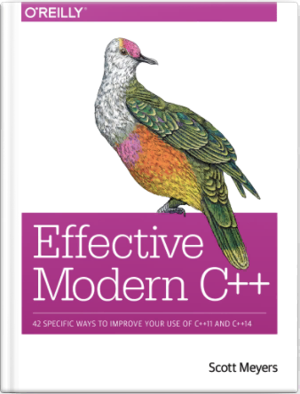
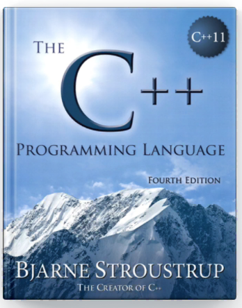
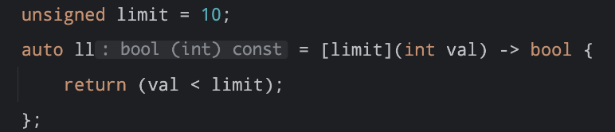

This Note Include Some Modern Or Special Features In C++

Overview of the content :

- Initialize
- Function
- Object
- Template
- Modern Feature
- Threads

Reference TextBook:

Effective Modern C++



The C++ Programming Language (4th Edition)


# Function

This Part of Note Mainly Include Some Function Utility and Advanced Feature

## Function Overload

To overload a function, declare multiple functions with the same name but _differently typed parameters_ or a _different number of parameters_

The Traits which will determine whether a function can be overloaded
- different number of parameters
- different parameters type

> Note : Whether a function can be overloaded is Unrelated with _return type_

Examples :
```c++
double divide(double x, double y){
return x / y;
}
int divide(int x, int y){
return x / y;
}
```

## Lambdas
Lambdas are inline, anonymous functions that can know about functions declared in their same scope!
```c++
auto var = [capture-clause] (paramaters) -> return type{
...
}
```
This is a template of a Lambdas expression
It Might look like something like this : 


There are some rules in Lambdas : 

| Capture options | descriptions                                 |
| --------------- | -------------------------------------------- |
| []              | capture nothing                              |
| [val]           | capture val by value                         |
| [&val]          | capture val by reference                     |
| [&val, other]   | capture val by reference, other by value     |
| [&, other]      | capture everything expect other by reference |
| [&]             | capture everything by reference              |
| [=]             | capture everything by value                  |

# Object

## Encapsulation

### Keyword
This Section include some keywords and the meaning of these keywords used in the class

#### public protected private
- Using _public_ keyword which specify the member or the variables in this section can be accessed by anyone !
- Using _private_ keyword which specify the member or the variables in this section can only be accessed by this class (can't not be accessed outside the class)!
- Using _protected_ keyword which specify the member or the variables in this section can be accessed by the derived class but can't be accessed by the other class !
```c++
class Restriction{  
public:  
      ...
protected:  
      ...
private:  
      ...
};
```

#### override specifier
Specifies that a virtual function override another virtual function

syntax:
The identify override, if used appears immediately after the declaration of the member function
```c++
void show_info() override
```

#### const
const specifier used to specify that a member function will not edit the member data. And if a object is a const object which means it only can call a member function which specifies const !

```c++
class Test{
	public:
		void func() const;
}
```

#### friend
The friend keyword allows non-member functions or classes to access private information in another class

Friend Declaration Should be something like this 
```c++
class Student;  
bool operator<(const Student& lhs, const Student& rhs);  
  
class Student {  
    friend bool operator<(const Student& lhs, const Student& rhs);  
private:  
    unsigned long _id;  
public:  
    Student() = default;  
    explicit constexpr Student(unsigned long id) : _id(id) { };  
    ~Student() = default;  
};  
  
bool operator<(const Student& lhs, const Student& rhs){  
    return lhs._id < rhs._id;  
}
```

#### delete & default
Setting a special member function to delete removes its functionality!
If a special member function has a delete trait, it will not be used in any object !

```c++
delete_member(const delete_member& other)  = delete;
```

You can also specify a special member function as default, in that case it will use the default version supported by the compiler 
```c++
class default_member{  
public:  
    default_member() = default;  
};
```
### Constructor

One Class At least have a constructor if you don't write one the compiler will generate one default constructor for you.

_Constructors_ are non-static member functions declared with a special declarator syntax, they are used to initialize objects of their class types.

It usually like in this form
```c++
ClassName(Parameters ...)
```
And it also has some declaration word with it

The constructor is called every time a new instance is created, and the destructor is called when it goes out of scope.

There are six special member functions! These functions are generated only when they're called (and before any are explicitly defined by you): 
	● Default constructor 
	● Destructor 
	● Copy constructor 
	● Copy assignment operator 
	● Move constructor 
	● Move assignment operator
We don’t have to write out any of these! They all have default versions that are generated automatically

>Initializer List 

We can used Initializer list to initialize our member variables, it is more efficient than the assigning way!
```c++
template <typename T>
vector<T>::vector<T>() :
 _size(0), _capacity(kInitialSize), 
 _elems(new T[kInitialSize]) {  }
```
It’s quicker and more efficient to directly construct member variables with intended values

#### Default Constructor

Default Constructor will do nothing in the coding block, but it will initialize member variables with the default value or all the member default constructor.

Declaring any user-defined constructor will make the default disappear without _=default_ specifier.

It you want to keep the default version of the constructor using this line:
```c++
ClassCase() = default;
```
#### Destructor

#### Copy Constructor
Object created as a copy of existing object (member variable-wise)

> Note : copy constructor only occur when construct an object 

#### Copy Assignment
Existing object replaced as a copy of another existing object

#### Move Constructor
Defining a move assignment operator prevents generation of a move copy constructor, and vice versa

#### Move Assignment
Defining a move assignment operator prevents generation of a move copy constructor, and vice versa

#### Converting Constructor

## Inheritance

### Inheritance Hierarchy

A Class can be Inherited and derived some subclasses. There are three different method of Inheritance !
- Public Inheritance
- Private Inheritance
- Protected Inheritance

## Polymorphism

### Polymorphism Base

#### Virtual Function

The _virtual_ specifies that a non-static member function is virtual and supports dynamic dispatch.
If a member function in base class is defined as virtual function. Then the member functions in derived class can override that function which can behave as different behaviors !

Virtual functions are member functions whose behavior can be overridden in derived classes. As opposed to non-virtual functions, the overriding behavior is preserved even if there is no compile-time information about the actual type of the class. 

That is to say, if a derived class Object is handled using pointer or reference to the base class, a call to an overridden virtual function would invoke the behavior defined in the derived class. Such a function call is known as _virtual function_
```c++
class Base_Class{  
public:  
    using Base_ptr = Base_Class*;  
    Base_Class() = default;  
    virtual void show_info(){  
        std::cout<<"This is a function from Base Class"<<"\n";  
    }  
};  
class Derived_Class : public Base_Class{  
public:  
    using Derived_ptr = Derived_Class*;  
    Derived_Class() : Base_Class{} {};  
    void show_info() override{  
        std::cout<<"This is a function from Derived Class "<<"\n";  
    }  
};  
  
int main(int argc, char *argv[]) {  
  
    Base_Class::Base_ptr  base_ptr;  
    Derived_Class derivedClass;  
    base_ptr = &derivedClass;  
    base_ptr->show_info();  
  
    return 0;  
}
```

In this way you can define a group of Base-Class pointer which actual point to the derived class object !

Pure Virtual Function:
A virtual function can be defined as a pure virtual function using `= 0` specifier !

if a function is defined as a pure virtual function than the class will not be instantiated !
```c++
class Abstract{  
public:  
    virtual void __func() = 0;  
};
```
> In the Example Above `__func` is a pure virtual function

And if a member function is defined as a pure virtual function, than any class which derived from that Base class it must implement these virtual function !

#### Abstract Class
Defines an abstract type which cannot be instantiated, but can be used as a base class

A Abstract at least have one pure virtual function !

```c++
class Abstract{  
public:  
    virtual void __func() = 0;  
};  
  
class Instance : public Abstract{  
public:  
    void __func() override{  
        std::cout<<"This class is a derived class from Abstraction !\n";  
    }  
};
```

If you try to Instantiated a Abstract Class it will occur a compile-time error !


### Advanced Polymorphism

#### VTable


# Template

## Template Class
A Class Can be Defined as a template class using this syntax
```c++
template <typename _Tp1, typename _Tp2>
class Instance;
```

## Template Function
Functions whose functionality can be adapted to more than one type or class without repeating the entire code for each type.

> Function Template is different from Class Template is that function argument can be automatically deducted, but class template can't !

## Meta Programming

### Template Cases
Example for Template Specialization with argument
```c++
template<unsigned n>  
struct factorial{  
    enum {value = n * factorial<n-1>::value};  
};  
template<>  
struct factorial<0>{  
    enum {value = 1};  
};
```
Code run during compile time !

constexpr in c++
Using keyword _constexpr_ can specify a expression allow compiler to get its value during compiling time !

- Constant expressions must be immediately initialized and will run at compile time!
- Passed arguments to constant expressions should be const/constant expressions as well.

```c++
constexpr unsigned factorial(unsigned n){  
    return (n <= 1) ? 1 : n * factorial(n - 1);  
}  
int main(int argc, char *argv[]) {  
    constexpr unsigned result = factorial(10);  
    std::cout << result << "\n";  
    return 0;  
}
```
### Concept
In C++ 20 The Concept is often used in Template

As of C++20, we can limit the acceptable types in: 
● template classes 
● template functions 
● non-template member functions of a template class

These limits or requirements on are called constraints. A named set of constraints is a concept.
```c++
template<typename _Tp>  
concept Addable = requires (_Tp a, _Tp b){  
    a + b;  
};  
  
template<typename _Tp>  
_Tp add(_Tp a, _Tp b) requires Addable<_Tp>{  
    return a + b;  
}
```
It also can write as this shorthand form
```c++
template<typename _Tp>  
concept Addable = requires (_Tp a, _Tp b){  
    a + b;  
};  
template<Addable _Tp>  
_Tp add(_Tp a, _Tp b){  
    return a + b;  
}
```
The concepts library provides definitions of fundamental library concepts that can be used to perform compile-time validation of template arguments and perform function dispatch based on properties of types. These concepts provide a foundation for equational reasoning in programs.


# Modern Feature

## Initialize

### Uniform Initialization

Using C++ Uniform Initialization, we can avoid error or narrow type casting !

Examples For C++ 11 Uniform Initialization
```c++
int data1(10.5);  // Direct Initialization (C++ will don't care about this)

int data2{10};   // Uniform Initialization (There will be a error occured)
```

Uniform Initialization For Class
```c++
class test{
private:
	int INT;
	bool BOOL;
public:
	test(int _int, bool _bool) : INT(_int), BOOL(_bool){
		std::cout<<"test(int _int, bool _bool)"<<std::endl;
	}
}; 
int main(){
	test test1{10, true};
	
	return 0;
}
```
### Structured Binding

In C++ 17 Structured Binding, we can set multiple variables simultaneously !

Example:
```c++
std::tuple<std::string, std::string, std::string> getInfo(){
	std::string name {"Stanford CS 106L"};
	std::string date {"2024-05-08"};
	std::string language{"C++"};
	return {name, date, language};
}
// We can get the result using this way
auto [name, date, language] = getInfo();
```

## Type Deduction

### auto


### decltype

Decltype is a C++ keyword used to automatically deduct a type of the object ! Notice that the decltype(val), the val must be an object rather than a type name.

> Side Note : decltype need an argument of the instance of the object, meta-programming std::is_same needs two type name, which is different from decltype.

A Small tips of std::is_same and _decltype_
```c++
EXPECT_EQUAL((std::is_same<std::random_access_iterator_tag,   
        decltype(std::iterator_traits<decltype(int_ptr)>::iterator_category())>()), true);
```