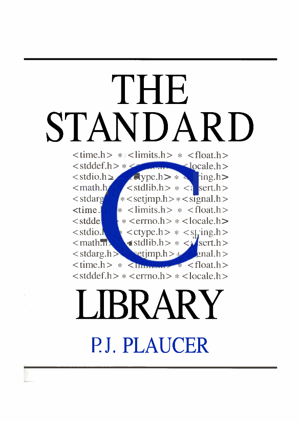
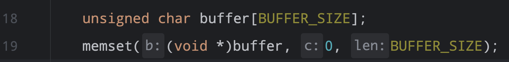
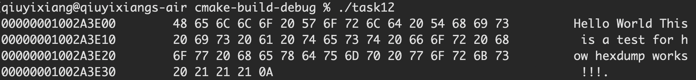
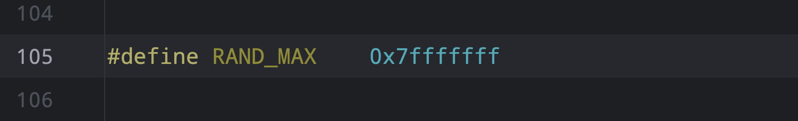

# Introduction

C Standard Library

This Note Mainly Include Some Topics in C Standard Library.
Cover ISO/ANSI C Standard : c89, c99, c11

Copyright : QiuYiXiang
Reference TextBook : 

Outsider Website : C Reference 

A Overview Of The Content :

- Diagnostic Library
- String Library
- Dynamic Memory Library
- Standard IO Library
- Type Library
- Numerics Library

Here is a List Of the Headers which will implement soon : 

The Headers which are included in C89
- <assert.h>
- <ctype.h>
- <errno.h>
- <float.h>
- <limits.h>
- <locale.h>
- <math.h>
- <setjmp.h>
- <signal.h>
- <stdarg.h>
- <stddef.h>
- <stdio.h>
- <stdlib.h>
- <string.h>
- <time.h>

# Diagnostic Library 

Diagnostic Library For C Standard 
- [assert](#assert)

## assert

```c
assert(expr)
```
description:
	assert is a function-like Macro in C Standard. if the _expr_ is true it do nothing else it will abort the program and show error message ! You can use _NDEBUG_ to disable the assertion !

argument:
- expr : judge whether the argument is true

return:
	None


# String Library

This Library Include Single-Byte (Character) and Multi-Byte (String) Functions and Utilities.

## Character

All Of these Character Function Defined In <ctype.h>

| Function       | Description                                                             |
| -------------- | ----------------------------------------------------------------------- |
| isalnum(char)  | checks if a character is alphanumeric                                   |
| isalpha(char)  | checks if a character is alphabetic                                     |
| islower(char)  | checks if a character is a lower alphabetic character                   |
| isupper(char)  | checks if a character is a upper alphabetic character                   |
| isdigit(char)  | checks if a character is a digit                                        |
| isxdigit(char) | checks if a character is a hexadecimal character                        |
| iscntrl(char)  | checks if a character is a control character                            |
| isgraph(char)  | checks if a character is a graphical character (visible character)      |
| isspace(char)  | checks if a character is a space character (\\n, \\t)                   |
| isblank(char)  | checks if a character is a blank character (\\0, \\t)                   |
| isprint(char)  | checks if a character is a printing character                           |
| ispunct(char)  | checks if a character is a punctuation (visible and non-zero character) |
| toupper(char)  | converts a character to uppercase                                       |
| tolower(char)  | converts a character to lowercase                                       |


General Purpose Function for the Character Detection:
```c
// checks if a character is a English Letter
isalpha(char)
// checks if a character is a number
isdigit(char)
// checks if a character is control character
iscntrol(char)
// checks if a character is printable
isprint(char)
``` 
ASCII Table

| Decimal | Hexidecimal   | ASCII                                |
| ------- | ------------- | ------------------------------------ |
| 0–8     | `\x0`–`\x8`   | control codes (`NUL`, etc.)          |
| 9       | `\x9`         | tab (`\t`)                           |
| 10-13   | `\xA`–`\xD`   | whitespaces (`\n`, `\v`, `\f`, `\r`) |
| 14–31   | `\xE`–`\x1F`  | control codes                        |
| 32      | `\x20`        | space                                |
| 33–47   | `\x21`–`\x2F` | `!"#$%&'()*+,-./`                    |
| 48–57   | `\x30`–`\x39` | `0123456789`                         |
| 58–64   | `\x3A`–`\x40` | `:;<=>?@`                            |
| 65–70   | `\x41`–`\x46` | `ABCDEF`                             |
| 71–90   | `\x47`–`\x5A` | `GHIJKLMNOP`  <br>`QRSTUVWXYZ`       |
| 91–96   | `\x5B`–`\x60` | `` [\]^_` ``                         |
| 97–102  | `\x61`–`\x66` | `abcdef`                             |
| 103–122 | `\x67`–`\x7A` | `ghijklmnop`  <br>`qrstuvwxyz`       |
| 123–126 | `\x7B`–`\x7E` | `{\|}~`                              |
| 127     | `\x7F`        | backspace character (`DEL`)          |

> You also can use command _man ascii_ to see ascii table !

## String


# Memory Library

## Memory Management

There are for main memory management function which controls dynamic memory !
- [malloc](#malloc)
- [calloc](#calloc)
- [realloc](#relloc)
- [free](#free)

## Memory Operation

These functions belong to string library but have the utility for memory operation !

> These Functions are included in <string.h>

Overview of the function:
- [memchr](#memchr)
- [memcmp](#memcmp)
- [memset](#memset)
- [memcpy](#memcpy)
- [memmove](#memmove)

### memset
```c
void *memset( void *dest, int ch, size_t count );
```
Description:
	Set a buffer of memory to _char_

argument:
- dest : a pointer to the buffer
- ch : default value
- count: the amount of bytes to be set

return:
	return the buffer address

Example:


## Other Memory Function

These Functions Doesn't belong to ISO/ANSI C or C++ Standard.
These are user defined functions

The function implementation and copyright belong to the author !
### hexdump
```c
void hexdump(void * base, size_t byte)
```
description:
	this function display how data layout in the raw memory

argument:
- base : a void pointer to the memory address
- byte : how many bytes you want to display

return :
- None !

Display Effect : 


Implementation:
```c
#ifndef LECTURE04_HEXDUMP_HH  
#define LECTURE04_HEXDUMP_HH  
  
/*  
 * The Implementation for utility function hexdump 
 * void hexdump(void * base, size_t byte); 
 * You can also use X86 or X86_64 to enable 32-bits or 64-bits address 
 * display Mode ! 
 * Create on : 2024-04-30  
 * Copyright : QiuYiXiang 
 */

#include <cstdio>  
#include <cstring>  
#include <cstdlib>  
#include <cstddef>  
#include <cctype>  
  
// The Macros Opener  
// _ARM32 _ARM64  
// _X86 _X86  
  
#define MAXI_LINE_DISPLAY   0x10  
#define NEXT_LINE           fprintf(stdout, "\n");  
  
void __hexdump_imp(unsigned char * __base_ptr, size_t __byte);  
void __show_line(unsigned char * __base_ptr, unsigned char * __char_ptr,  
                 unsigned int __maxi = MAXI_LINE_DISPLAY);  
  
/// Export Interface  
void hexdump(void * base, size_t byte){  
    __hexdump_imp(reinterpret_cast<unsigned char*>(base), byte);  
}  
  
void __hexdump_imp(unsigned char * __base_ptr, size_t __byte){  
    if (__byte <= MAXI_LINE_DISPLAY)  
        __show_line(__base_ptr, __base_ptr);  
    for (unsigned int index = 0; index != __byte / MAXI_LINE_DISPLAY; ++index){  
        __show_line(__base_ptr, __base_ptr);  
        __base_ptr += MAXI_LINE_DISPLAY;  
    }  
    __show_line(__base_ptr, __base_ptr, __byte % MAXI_LINE_DISPLAY);  
}  
  
void __show_line(unsigned char * __base_ptr, unsigned char * __char_ptr,  
                 unsigned int __maxi){  
#if defined(_ARM64) || defined(_X64)  
    fprintf(stdout, "%.16lX\t", (unsigned long)__base_ptr);  
#elif defined(_ARM32) || defined(_X86)  
    fprintf(stdout, "%.8X\t", (unsigned int)__base_ptr);  
#endif  
    for (unsigned _index = 0; _index != __maxi; ++_index, ++__base_ptr)  
        fprintf(stdout, "%.2X ", (unsigned int)*__base_ptr);  
  
    /// Fill With Space  
    if (__maxi % MAXI_LINE_DISPLAY != 0){  
        for (unsigned int x = 0; x != MAXI_LINE_DISPLAY - (__maxi % MAXI_LINE_DISPLAY);  
        ++x)  
            fputs("   ", stdout);  
    }  
    fputc(static_cast<int>('\t'), stdout);  
    for (unsigned _index = 0; _index != __maxi; ++_index, ++__char_ptr){  
        if (isprint((int)*__char_ptr))  
            fprintf(stdout, "%c", (unsigned char)*__char_ptr);  
        else  
            fprintf(stdout, ".");  
    }  
    NEXT_LINE  
}  
#endif //LECTURE04_HEXDUMP_HH
```
# Standard IO Library

C Provide Some Standard IO Library Interface

## Types In IO

Some Typedef For C IO Object:

| Type     | Description                                                    |
| -------- | -------------------------------------------------------------- |
| FILE     | File Object                                                    |
| fpos_t   | File Position Type Usually be _unsigned long_                  |
| stdin    | Macro for FILE * object associative with standard input stream |
| stdout   | FILE * object associative with standard output stream          |
| stderror | FILE * object associative with standard error output stream    |

_FILE_ object type, capable of holding all information needed to control a C I/O stream
eg:
```c
typedef struct _FILEs{
// ......
}FILE
```

## Error Handler
In the Standard IO Library, it also support some error handling Function

- [clearerr](#clearerr)
- [feof](#feof)
- [ferror](#ferror)
- [perror](#perror)

## File Operation

The Overview of File Operation
- General File Operation
	- [fopen](#fopen)
	- [fclose](#fclose)
	- [fflush](#fflush)
	- [setbuf](#setbuf)
- Direct File IO
	- [fread](#fread)
	- [fwrite](#fwrite)
- File Operation
	- [ftell](#ftell)
	- [fgetpos](#fgetpos)
	- [fseek](#fseek)
	- [fsetpos](#fsetpos)
	- [rewind](#rewind)
	- [remove](#remove)
	- [rename](#rename)

### fopen
```c
FILE *fopen( const char *filename, const char *mode );
```
Description:
	Opens a file indicated by `filename` and returns a pointer to the file stream associated with that file. `mode` is used to determine the file access mode

Argument:
- filename : the file name of which file will be opened
- mode : a string which denote which mode will be used

return:
	A pointer point to the file stream object

Operation Mode :

|File access  <br>mode string|Meaning|Explanation|Action if file  <br>already exists|Action if file  <br>does not exist|
|---|---|---|---|---|
|"r"|read|Open a file for reading|read from start|failure to open|
|"w"|write|Create a file for writing|destroy contents|create new|
|"a"|append|Append to a file|write to end|create new|
|"r+"|read extended|Open a file for read/write|read from start|error|
|"w+"|write extended|Create a file for read/write|destroy contents|create new|
|"a+"|append extended|Open a file for read/write|write to end|create new|

### fread
```c
size_t fread( void *buffer, size_t size, size_t count,FILE *stream );
```
Description:
	read up to _size * count_ bytes to the array buffer from file _stream_.
	This function is very similar to the POSIX Unix _read_ function.

Argument:
- buffer : destination of the array buffer
- size : the bytes of each Objects in bytes
- count: the number of how many object will be read
- stream : the pointer to the File stream

return:
	Number of objects read successfully, which may be less than count if an error or end-of-file condition occurs.

### fwrite
```c
size_t fwrite( void *buffer, size_t size, size_t count, FILE *stream );
```
Description:
	write up to _size * count_ bytes from the array buffer to file _stream_.
	This function is very similar to the POSIX Unix _write_ function.

Argument:
- buffer : source of the array buffer
- size : the bytes of each Objects in bytes
- count: the number of how many object will be read
- stream : the pointer to the File stream

return:
	Number of objects write successfully, which may be less than count if an error or end-of-file condition occurs.
## Formatted IO

Overview of Formatted IO Function:

- Input Function
	- [scanf](#scanf)
	- [fscanf](#fscanf)
	- [sscanf](#sscanf)
	- [vscanf](#vscanf)
	- [vfscanf](#vfscanf)
	- [vsscanf](#vsscanf)
- Output Function
	- [printf](#printf)
	- [fprintf](#fprintf)
	- [sprintf](#sprintf)
	- [snprintf](#snprintf)
	- [vprintf](#vprintf)
	- [vfprintf](#vfprintf)
	- [vsprintf](#vsprintf)
	- [vsnprintf](#vsnprintf)
## UnFormatted IO

Overview of Unformatted IO Function:

- Input Function
	- [fgetc](#fgetc)
	- [fgets](#fgets)
	- [getchar](#getchar)
	- [gets](#gets)
- Output Function
	- [fputc](#fputc)
	- [fputs](#fputs)
	- [putchar](#putchar)
	- [puts](#puts)
- Other Function
	- [ungetc](#ungetc)

### fgetc
```c
int fgetc(FILE * stream);
```
Description:
	Reads the next character from the given input stream

Argument:
- stream : read from which stream

return:
	return the unsigned char cast to int, if failure return to _EOF_

### fputc
```c
int fputc(int ch, FILE * stream);
```
Description:
	Write the _char_ character to the given output stream

Argument:
- ch : the character will be written
- stream : write to which stream

return:
	On success, returns the written character.
	On failure, returns EOF and sets the _error_ indicator
	
# Type Library

There are some different type support Library In C . Here Mainly Include <stddef.h>
There are different type define in <stddef.h>

> Some Type Define There , There are just Macros, this approach is useful when you want to implement a kernel and use a portable C Standard library !

- size_t  : unsigned integer type
- ptrdiff_t :  signed integer type
- wchar_t : unsigned char type the size of this type may be 2 or 4 according to the implementation and machine architecture
- NULL : which is a pointer type which means 0  _((void *)0)_

The Function-like Macro offsetof:
```C
offsetof(type, member)
```

description : 
	This is a function-like macro which used to return the offset of the _member_ in the struct type _type_. 

argument:
- type : the type of the structure
- member : the member of the structure

return:
	size_t, return the _size_t_ type which is the offset of the _member_ in _type_

# Numerics Library

Numerics Library can be divided into different smaller parts :
content :
- Pseudo-random Library


## Pseudo-random Library

There are two main function and a Macro in the Pseudo-random Library.
- [rand](#rand)
- [srand](#srand)

RAND_MAX : Expands to an integer constant expression equal to the maximum value returned by the function _rand_. This value is implementation dependent


The Definition for GNU glibc-11 for Macro RAND_MAX
### rand
```c
int rand();
```
Description:
	Returns a pseudo-random integer value between 0 and _RAND_MAX_, if the seeds is the same value then the function _rand()_ will always return the same series of random value !

return:
	Returns a pseudo-random integer value between 0 and _RAND_MAX_

### srand
```c
void srand(unsigned int seed);
```
Description:
	Set Seeds To the pseudo-random number generator _rand()_

Argument:
- seed : the seed used for _rand()_

Example For _rand_ and _srand_
```c
srand(time(NULL));
int res = rand();
```
get a random number, and set seeds to the current time !