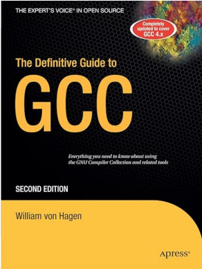

This Note Contain Some Features and Options In GNU CC Compiler !

Reference TextBook : 

And GNU GCC Documentation

Overview of the content : 
- Options
	- General Options
	- C Options
	- C++ Options
	- Warning Options
	- Debugging Options
	- X86 Options
	- RISC-V Options

# Options

## General Options

This Tables Contain Some General Purpose Options

| Command       | Descriptions                                                  |
| ------------- | ------------------------------------------------------------- |
| --help        | show help information                                         |
| -v            | show all the details in the Compilation Process               |
| -E            | Preprocessor Only                                             |
| -S            | Assemble Only                                                 |
| -c            | Compile Only                                                  |
| -o            | Specify Output file                                           |
| -x _language_ | Specify Input file language (the value could be c, c++......) |

## C Options

This Table Contains Some Options Which Only Apply for C Programming Language

| Command | Descriptions                                                                            |
| ------- | --------------------------------------------------------------------------------------- |
| -ansi   | In C mode, this is equivalent to -std=c90. In C++ mode, it is equivalent to -std=c++98. |
| -std=   | Determine Language Standard (The Value could be c89, c90, c99, c11, c17, c18)           |
|         |                                                                                         |

## C++ Options 

This Table Contains Some Options Which Only Apply for C++ Programming Language

## Warning Options

This Table Display some Options Related to Warning

| Command  | Descriptions                                                        |
| -------- | ------------------------------------------------------------------- |
| -w       | Inhibit all warning messages                                        |
| -Werror  | Make all warnings into errors                                       |
| -Wall    | Enable All Warnings                                                 |
| -Wextra  | This enables some extra warning flags that are not enabled by -Wall |
| -Wshadow | When Variable is shadowed it will let you know                      |

## Debugging Options

These commands are related to debugger

| Command            | Descriptions                                          |
| ------------------ | ----------------------------------------------------- |
| -g                 | enable debugger and generate some debugger message    |
| -fsanitize=address | Enable AddressSanitizer, a fast memory error detector |

## X86 Options

## RISC-V Options