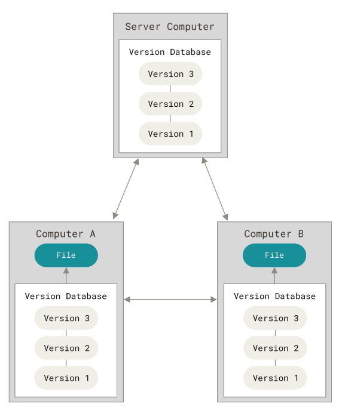
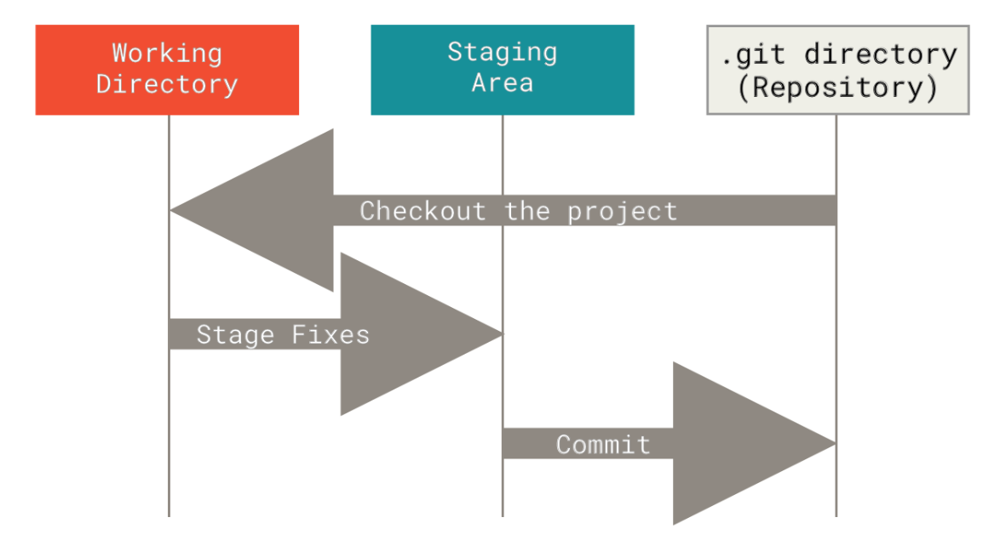

Version control is a system that records changes to a file or set of files over time. Git is a powerful Distributed Version Control System. This note will introduce some basic aspects of git, git interfaces and dive into the core of git.

# Git Concept

Here is the Git working model, git is a Distributed Version Control System (DVCS). Every computer has its own copy and is independent to the server. 


## File Status

There are three main states that your files can resides in git.

- Modified : Modified means that you have changed the file but have not committed it to your database yet.
- Staged : Staged means that you have marked a modified file in its current version to go into your next commit snapshot.
- Committed : Committed means that the data is safely stored in your local database.

This will lead us to the three main sections of a Git project : the working tree, the staging area, and the Git directory.



# Git Command

## Initialize

### git config

Git comes with a tool called _git config_ that lets you get and set configuration variables that control all aspects of how Git looks and operates.
These variables can be stored in three different places:

1. [path]/etc/gitconfig file: Contains values applied to every user on the system and all their repositories. Can be controlled using _--system_ option.
2. ~/.gitconfig file : Values specific for the user. Can be controlled using _--global_ option.
3. config file in the Git Repository: Values specific for the current repository. Can be controlled using _--local_ option. (the default option)


Searching Path Related Options

| Option   | Usage                                                                  |
| -------- | ---------------------------------------------------------------------- |
| --system | Read or write configuration values from [path]/etc/gitconfig           |
| --global | Read or write configuration values from ~/.gitconfig                   |
| --local  | Read or write configuration values from .git/config (default behavior) |

Main Options

| Option        | Usage                                                          |
| ------------- | -------------------------------------------------------------- |
| --list        | List all variables set in config file, along with their values |
| --show-origin | Show the origin of the configuration file and their type       |


Configuration Variable

| Variable           | Usage                       |
| ------------------ | --------------------------- |
| user.name          | User name                   |
| user.email         | User email                  |
| core.editor        | Set default text editor     |
| init.defaultBranch | Set the default branch name |


### init

_git init_ will create an empty Git repository or reinitialize an existing one.


## General

### help
_git help_ display the help information about Git in manpage. General form of usage `git help <verb>`. Similar way for getting help is just type `-h` in the command

```shell
git config -h
```


## Snapshotting

### add
_git add_

## Branching


## Remote
